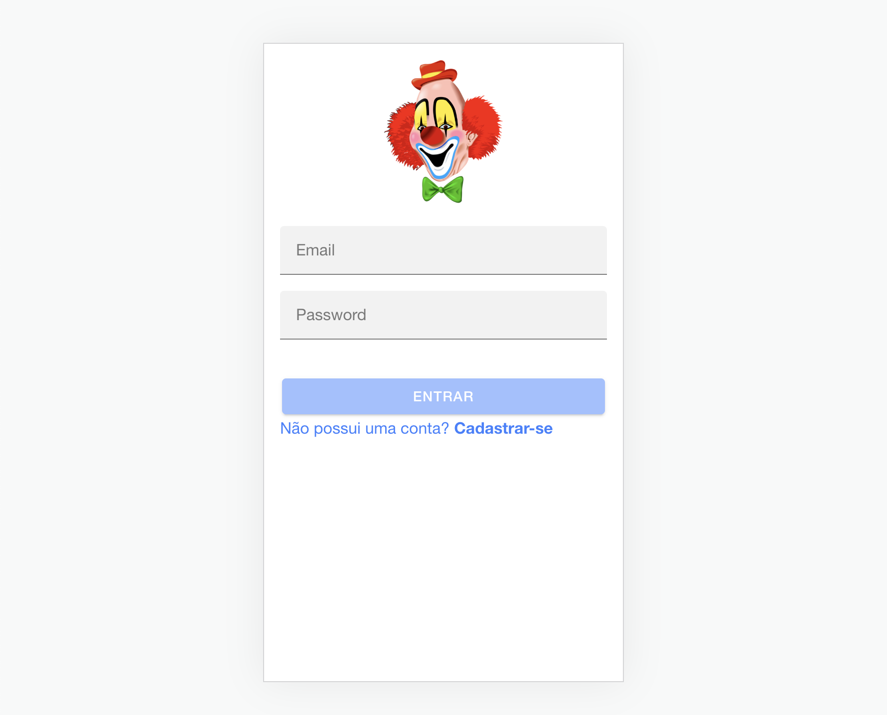

# Treinamento Ionic



![version][version-badge] ![Idioma][idioma] ![status][status-emprogresso]

### Para rodar este projeto é necessário
#### Clonar o repositório
```bash
$ git clone https://github.com/TomCosta/ionic-treinamento
``` 
#### Entrar na pasta do projeto
```bash
$ cd fishApp
``` 
### Reinstalar as dependências
```bash
$ npm install
```
### Rodar localmente no navegador
```bash
$ ionic s
```
### ------------------------------------------------------------------
# Se não tiver o Ionic instalado

Use o comando abaixo:

```bash
$ npm install -g @ionic/cli
```

Então repita os passos iniciais para rodar o projeto. 

# Extras
## Gerar componentes, pipes, services, etc.
### Run 
```bash
$ ionic g c `component-name` to generate a new component
```
### You can also try anything else:
```bash
$ ionic g `directive|pipe|service|class|guard|interface|enum|module`
```
#

[CHANGELOG]: ./CHANGELOG.md
[version-badge]: https://img.shields.io/badge/version-1.0.0-blue.svg
[license-badge]: https://img.shields.io/badge/license-MIT-blue.svg
[status-emprogresso]: https://img.shields.io/badge/status-Em%20progresso-blueviolet
[idioma]: https://img.shields.io/badge/idioma-Portugu%C3%AAs-800060
[Super Team]: https://github.com/TomCosta/angularMarket/blob/master/super_team_80x80.jpg